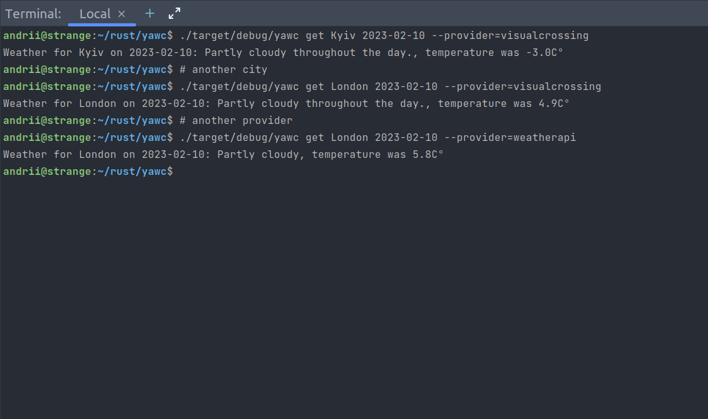

# yawc
yet another weather checker

### About the project
<hr>
yawc is a CLI tool to check historic weather:
<br/><br/>


### Usage
<hr>

```shell
Weather CLI

Usage: yawc <COMMAND>

Commands:
  # Configure credentials for `provider`, where `provider` is some short name for a concrete weather API
  configure <provider>
  # Show weather for the provided `address` The date parameter is optional, default is now
  get       <address> <date:optional> <--provider=<optional>> 
  # Print this message or the help of the given subcommand(s)
  help
  
Options:
  -h, --help  Print help

```

### Building and testing
<hr>
You can build and test this project using cargo like the following:

#### Building
```shell
cargo build
```

#### Testing
```shell
cargo test
```
